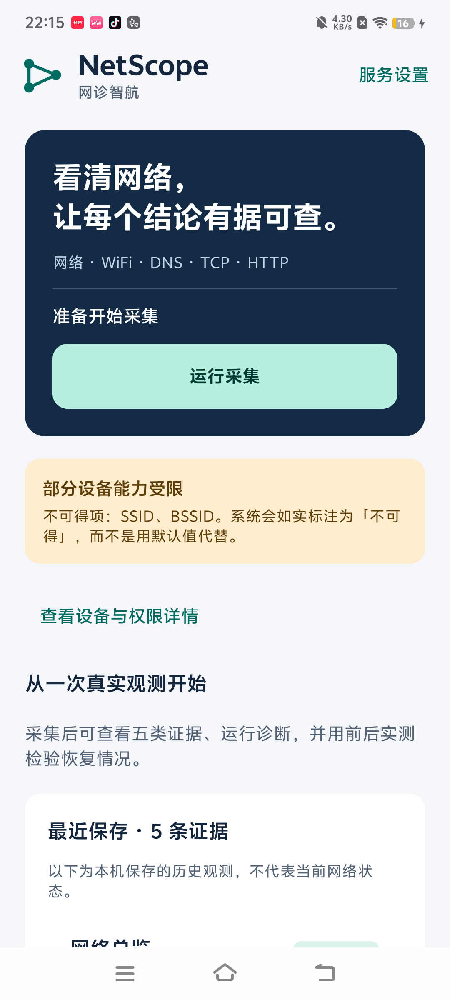
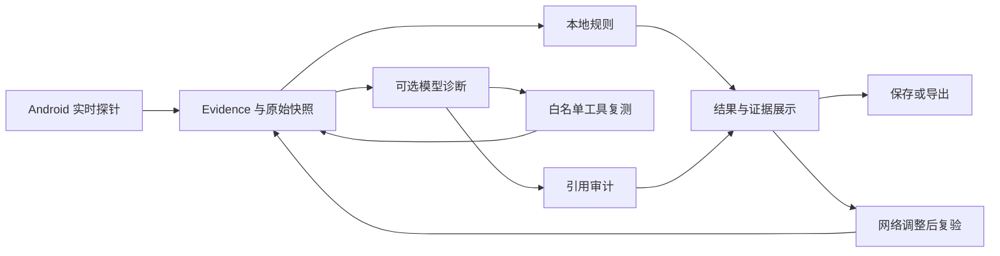

# NetScope 网诊智航

**面向 Android 终端的证据驱动网络诊断应用。**

NetScope 将真实网络采集、本地规则、受约束的模型工具调用和前后复验放在同一条诊断流程中。每条观测保留来源、时间、状态和原始快照，让用户能够检查结论依据。基础采集与规则诊断在本机运行；模型辅助诊断通过独立网关接入 OpenAI 兼容服务。




界面截图来自 Android 真机。实际字段由设备权限、系统能力和当前网络决定，读取不到的数据明确标为不可得。

## 核心功能

| 功能 | 实现 |
|---|---|
| 实时网络观测 | 网络总览、WiFi、DNS、TCP、HTTP 五类探针并行执行 |
| 证据展开 | 查看状态、metrics、来源 API、采集时刻及原始快照 |
| 本地规则诊断 | 解释 JSON 规则；缺失、占位或非法指标不构成命中 |
| 模型工具复测 | 固定五工具白名单、空参数校验、调用数与时间预算 |
| 结论引用审计 | 检查本次证据引用的存在性、唯一性与可用状态；不合规时整轮拦截 |
| 前后复验 | 重跑同批探针，对照执行状态和共同数值指标 |
| 保存与导出 | Room 保存证据快照，启动加载最近记录，导出结构化诊断档案 |
| 模型网关 | 服务端持有 API Key，提供认证、限流、调用额度及请求追踪 |

## 工作流程



本地规则与模型结论分别展示。模型服务未配置或不可用时，真实采集、本地规则及档案功能仍可使用。引用审计检查证据结构与执行状态，不能代替自然语言结论的语义核对；前后复验报告观测变化，不能单独证明修复动作的因果。

## 技术栈

- Android：Kotlin、Jetpack Compose / Material 3、Coroutines、Hilt、Room、kotlinx.serialization。
- 构建：Gradle 8.11.1、AGP 8.7.3、JDK / JVM target 17，compileSdk / targetSdk 35，minSdk 26。
- 网关：Node.js 24 内置模块；运行网关不需要安装第三方 npm 依赖。
- 验证：Android JUnit 测试覆盖模型边界、规则、序列化、导出与复验；Node 内置测试覆盖认证、额度、限制与降级。

## 本地构建

1. 安装 JDK 17 与 Android SDK Platform 35、Build Tools 35.0.0、platform-tools。AGP 默认选择的 Build Tools 版本为 34.0.0，首次构建也需要该包。
2. 在仓库根目录创建仅属于本机的 `local.properties`，使用实际 SDK 路径。例如 Windows：

   ```properties
   sdk.dir=D:/Android/Sdk
   ```

3. 在项目根目录执行：

   ```powershell
   .\gradlew.bat :app:assembleDebug
   .\gradlew.bat :app:testDebugUnitTest
   .\gradlew.bat :app:assembleRelease
   ```

   macOS / Linux 使用 `./gradlew`。在 Windows 上建议使用不含中文或空格的工程路径，以避免 Java 测试进程的路径编码问题。

Debug 安装包位于 `app/build/outputs/apk/debug/app-debug.apk`，包名为 `com.netscope.debug`。Release 位于 `app/build/outputs/apk/release/app-release.apk`，包名为 `com.netscope`。未配置正式签名时，Release 使用本机 debug 签名，适合开发安装；正式发布签名配置见[构建说明](docs/building.md)。

```powershell
adb install -r app/build/outputs/apk/debug/app-debug.apk
```

## 可选模型接入

模型能力需要单独运行网关；上游 API Key 留在服务端，不填写到手机中。

```powershell
node backend/server.js
```

未配置上游时，`GET http://127.0.0.1:8787/health` 返回网关状态，诊断请求返回 `503 model_unavailable`。配置上游的完整 `/chat/completions` URL 和 API Key 后，可通过 USB 调试映射访问本机：

```powershell
adb reverse tcp:8787 tcp:8787
.\gradlew.bat :app:assembleDebug -PNETSCOPE_MODEL_ID=qwen-plus
```

服务配置中的模型 ID 必须与实际服务商提供的模型一致。手机“服务设置”填写网关的完整 `/v1/chat/completions` 地址；公网接入使用 HTTPS 和服务访问码。详见[网关运行说明](backend/README.md)与[模型协议](docs/model-protocol.md)。

## 目录

```text
app/
  src/main/java/com/netscope/
    core/collector/      真实探针与执行边界
    core/model/          Evidence、Claim 与状态模型
    core/rules/          声明式规则解释器
    core/agent/          模型协议、工具执行、预算与引用审计
    core/verification/   前后观测对照
    core/export/         诊断档案序列化
    data/store/          Room 证据快照
    ui/                  Compose 界面与主题
  src/test/              Android JVM 单元测试
backend/                 Node 模型网关及测试
docs/                    架构、指标契约、构建与隐私说明
gradle/                  版本目录与 Gradle Wrapper
```

## 文档与验证

- [系统架构](docs/architecture.md)
- [指标与证据契约](docs/metrics-schema-v1.md)
- [模型接口与工具协议](docs/model-protocol.md)
- [构建与签名](docs/building.md)
- [数据与隐私](docs/privacy.md)
- [验证方式](docs/testing.md)

```powershell
node --test backend/server.test.js
```

测试中的模拟输入用于验证工程约束，与应用实际采集的网络数据分开。应用不会使用测试样本填充真机采集结果。
