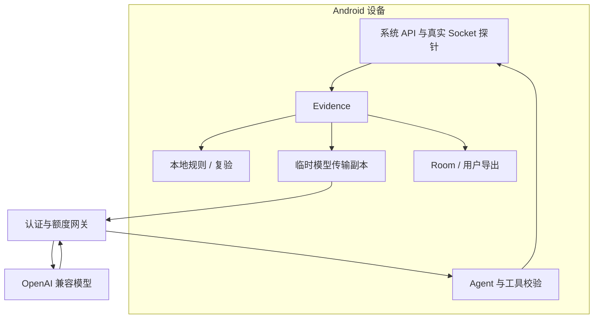

# 系统架构

NetScope 的事实入口是 Android 探针。规则和模型共享 Evidence，展示与保存使用同一份证据对象。模型不能直接执行 shell、修改网络配置或选择任意探测地址。

## 从观测到证据

`ProbeTask` 包装采集器执行，统一记录时间、证据编号与来源，并吸收超时和异常。五探针通过协程并行运行。`Evidence` 保存 `id`、`type`、`status`、`metrics`、`rawSnapshot`、`source`、`timestampMs`、`durationMs`、`message`。

失败、超时及不支持的探针不输出成功指标。成功路径中的字段缺失使用既有占位约定，与数值零、空列表和不存在的键分别处理。详见[指标契约](metrics-schema-v1.md)。

## 规则解释

规则来自 `app/src/main/assets/rules/core-rules.json`。求值器按类型选取最新证据，逐项检查状态与条件；仅有状态条件时可匹配明确失败现象，有指标条件时必须取得可用指标。数字比较仅接受可解析整数。所有条件成立才生成规则命中及去重证据引用，按配置分值排序。规则分值是排序配置，不是经过统计校准的故障概率。

## 模型诊断

`AgentRunner` 维护消息、工具轨迹与证据集合。模型返回工具调用时，`ToolInvoker` 校验固定名称和空 JSON 参数，然后使用已有采集器取得新证据。调用尝试受 `BudgetGuard` 的 8 次 / 90 秒预算限制，Agent 循环最多 10 轮。

最终提案交给 `HallucinationAuditor` 检查引用结构。引用必须来自本次会话并指向可用证据，文本、重复引用和置信度也有校验。任一不合规提案或不完整会话会保留拒绝原因，避免作为成功结论展示。该机制不能自动判定语言解释与事实是否语义一致。

## 复验与历史

复验重新运行同一批探针，按类型对照先前证据与新证据。共同且可解析的数值字段用于前后展示；缺失字段不插值。只有全部观测与规则条件满足时才报告观察到恢复。

Room 按诊断记录存储序列化证据快照。启动时加载最近保存的记录，明确标为历史观测。结构化导出另外携带规则、模型工具轨迹与复验报告；导出不将访问码写入档案。

## 信任边界

HTTP 敏感头在临时模型传输副本中遮蔽，设备内原始观测保持原状。网络拓扑、地址和信号仍可能进入模型请求，应按实际使用场景确认数据处理要求。网关配置与日志见[数据与隐私](privacy.md)。
